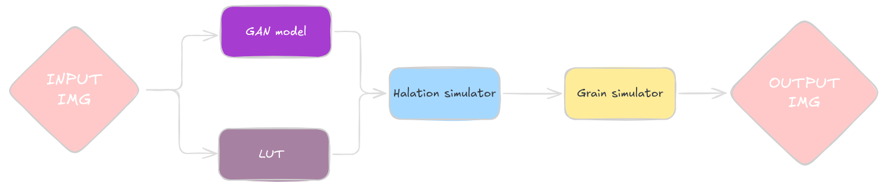

# Analog Photo Generator

This project allows you to create analog-style photos from digital images using Python.

## Features

- Convert digital photos to analog-style images
- Adjustable parameters
## pipelines



## Installation

Before running the project, ensure you have Python installed on your system. Then, install the required dependencies using pip:

```bash

pip install -r requirements.txt

```

## How to use

At this point there are 2 working scripts, _grain.py_ and _haliation.py_ both in src/ folder.

*for the development version, the file paths are hardcoded in the scripts.*


in order to run it:
```
python3 -m src.grain 
```
and 
```
python3 -m src.haliation
```


Photo (_media/tests/p2.jpg_) by <a href="https://unsplash.com/@ehsan1408?utm_source=unsplash&utm_medium=referral&utm_content=creditCopyText">Ehsan Ahmadi</a> on <a href="https://unsplash.com/photos/woman-with-red-lipstick-and-black-mascara-vsWy6nchcOs?utm_source=unsplash&utm_medium=referral&utm_content=creditCopyText">Unsplash</a>
      
